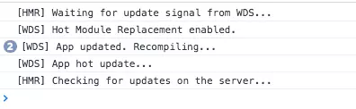

### 热替换

1. 复制 001 basic 为 004 optimize 
  
  ```sh 
  cp -r "001 basic" "004 optimize"
  ```

2. 设置 HMR

```js
 plugins: [
    new webpack.NamedModulesPlugin(),
    new webpack.HotModuleReplacementPlugin()
  ],
  devServer: {
    hot: true
  }
```  


3. 压缩图片

```js
{
  test: /\.(png|jpe?g|gif|svg|webp)$/,
  use: [
    {
      loader: 'url-loader',
      options: {
        limit: 8192
      }
    },
    {
      loader: 'image-webpack-loader',
      options: {
        mozjpeg: {  // 压缩 jpeg 的配置
          progressive: true,
          quality: 65
        },
        optipng: {  // 使用 imagemin-optipng 压缩 png，enable: false 为关闭
          enabled: false,
        },
        pngquant: { // 使用 imagemin-pngquant 压缩 png
          quality: '65-90',
          speed: 4
        },
        gifsicle: { // 压缩 gif 的配置
          interlaced: false
        },
        webp: { // 开启 webp，会把 jpg 和 png 图片压缩为 webp 格式
          quality: 75
        }
      }
    }
  ]
}
```


4. 使用 postscss css-sprites


```js

{
  test: /\.less$/,
  use: ExtractTextPlugin.extract({
    fallback: 'style-loader',
    use: [
      'css-loader',
      'postcss-loader',
      'less-loader'
    ]
  })
},
```

**postcss.config.js**

```js
module.exports = {
  plugins: [
    require('autoprefixer')(),
    require('postcss-sprites')({
      filterBy(image) {
        if(/sprites/.test(image.url)){
          return Promise.resolve()
        } else {
          return Promise.reject()
        }
      }
    })
  ]
}
```


5. 使用tree-shaking, sideEffects

.babelrc


```js
{
    "presets": [
      [
        "@babel/preset-env", 
        {
          "modules": false,
          "loose": true
        }  
      ]
    ],
    "plugins": [
      "syntax-dynamic-import"
    ]
}
```


6. 使用 @babel/plugin-transform-runtime @babel/runtime

.babelrc

```js
{
    "presets": [
      [
        "@babel/preset-env", 
        {
          "modules": false,
          "loose": true
        }  
      ]
    ],
    "plugins": [
      "@babel/transform-runtime",
      "syntax-dynamic-import"
    ]
}
```


7. 使用 @babel/polyfill


.babelrc 

```js
{
    "presets": [
      [
        "@babel/preset-env", 
        {
          "modules": false,
          "loose": true,
          "useBuiltIns": "entry", // 入口处引入polyfill
          "targets": {
            "browsers": ["ie>=8"]  // 浏览器环境，配置需要兼容的浏览器列表
          },
          "debug": true
        }  
      ]
    ],
    "plugins": [
      "@babel/transform-runtime",
      "syntax-dynamic-import"
    ]
}
```


### HMR 运行原理

> webpack 内部运行时，会维护一份用于管理构建代码时各个模块之间交互的表数据，webpack 官方称之为 Manifest，其中包括入口代码文件和构建出来的 bundle 文件的对应关系。可以使用 WebpackManifestPlugin 插件来输出这样的一份数据。





> 开启了 hot 功能的 webpack 会往我们应用的主要代码中添加 WS 相关的代码，用于和服务器保持连接，等待更新动作。

> 当你配置了 HMR 的插件时，会往应用代码中添加 HMR 运行时的代码，主要用于定义代码模块应用更新时的 API，后面会详细介绍。

> 源码：HotModuleReplacement.runtime.js](https://link.juejin.im/?target=https%3A%2F%2Fgithub.com%2Fwebpack%2Fwebpack%2Fblob%2Fmaster%2Flib%2FHotModuleReplacement.runtime.js)

> 有了这两个部分就可以支持整个 HMR 的功能了。我们先忽略流程图的右上角部分，左下角的流程相对容易理解：当有更新时，webpack-dev-server 发送更新信号给 HMR 运行时，然后 HMR 再请求所需要的更新数据，请求的更新数据没有问题的话就应用更新。

> 如果 HMR 只是简单替换了代码模块的内容，如替换掉所谓的 installedModules 中需要更新的部分，那么这样并没有办法把更新后的结果实时地在浏览器上显示出来，所以才会需要流程图的右上角部分。

> 前面提到的 HMR 运行时代码会提供定义代码模块应用更新时执行的 API，这些 API 可以让我们在模块中定义接收到 HMR 更新应用信号时，需要额外做什么工作。例如， style-loader 就需要实现 HMR 接口，当收到更新时，使用新的样式替换掉旧的样式，大概是这样：

```js
if (module.hot) {
  module.hot.accept('/some/path', function() {
    // ... 用新样式替换旧样式
  })
}
```

> 详情可以参考 style-loader 中的代码实现：[HMR interface implemention in style-loader](https://link.juejin.im/?target=https%3A%2F%2Fgithub.com%2Fwebpack-contrib%2Fstyle-loader%2Fblob%2Fmaster%2Findex.js%23L36)。

> HMR 应用更新时是使用 webpackHotUpdate 来处理的：

```js
webpackHotUpdate(id, { 
  'modulePath': 
  function() {
    // 模块更新后的代码
  }
})
```

> 执行 webpackHotUpdate 时如发现模块代码实现了 HMR 接口，就会执行相应的回调或者方法，从而达到应用更新时，模块可以自行管理自己所需要额外做的工作。不过，并不是所有的模块都需要做相关的处理，当遇见没有实现 HMR 接口的模块时，就会往上层冒泡，如本节开头部分的流程图所示。


> 这里还有一个问题是，webpack 如何保证 HMR 接口中的引用是最新的模块代码？我们看一个简单的例子：

```js
import './index.css'
import hello from './bar'

hello()

if (module.hot) {
  module.hot.accept('./bar', () => {
    // console.log('Accepting the updated bar module!')
    hello()
  })
}
```

> 从代码上看，hello 都是同一个，这样的话并没有办法引用最新的模块代码，但是我们看一下上述代码在 webpack 构建后的结果：

```js
if (true) {
  module.hot.accept("./src/bar.js", function(__WEBPACK_OUTDATED_DEPENDENCIES__) { 
    /* harmony import */ 
    __WEBPACK_IMPORTED_MODULE_1__bar__ = __webpack_require__("./src/bar.js"); 
    (() => {
      // console.log('Accepting the updated bar module!')
      Object(__WEBPACK_IMPORTED_MODULE_1__bar__["default"])()
    })(__WEBPACK_OUTDATED_DEPENDENCIES__); 
  })
}
```


> 其他代码比较杂，我们集中看 module.hot 的处理部分。这里可以发现，我们的 hello 已经重新使用 __webpack_require__ 来引用了，所以可以确保它是最新的模块代码。

> 基本上 HMR 的执行原理就是这样，更具体的实现部分就不展开讲解了。在日常开发中，我们需要更多的工具来帮助我们实现 HMR 的接口，避免编写过多 HMR 需要的代码。例如，React 在组件代码更新时可能需要触发重新 render 来实现实时的组件展示效果，官方提供了一些现有的工具，需要的可以参考一下：[hot module replacement tools](https://link.juejin.im/?target=https%3A%2F%2Fwebpack.js.org%2Fguides%2Fhot-module-replacement%2F%23other-code-and-frameworks)。


### module.hot 常见的 API

> 前面 HMR 实现部分已经讲解了实现 HMR 接口的重要性，下面来看看常见的 module.hot API 有哪些，以及如何使用。

> 之前已经简单介绍过，module.hot.accept 方法指定在应用特定代码模块更新时执行相应的 callback，第一个参数可以是字符串或者数组，如：

```js
if (module.hot) {
  module.hot.accept(['./bar.js', './index.css'], () => {
    // ... 这样当 bar.js 或者 index.css 更新时都会执行该函数
  })
}
```

> module.hot.decline 对于指定的代码模块，拒绝进行模块代码的更新，进入更新失败状态，如 module.hot.decline('./bar.js')。这个方法比较少用到。

> module.hot.dispose 用于添加一个处理函数，在当前模块代码被替换时运行该函数，例如：

```js
if (module.hot) {
  module.hot.dispose((data) => {
    // data 用于传递数据，如果有需要传递的数据可以挂在 data 对象上，然后在模块代码更新后可以通过 module.hot.data 来获取
  })
}
```

> module.hot.accept 通常用于指定当前依赖的某个模块更新时需要做的处理，如果是当前模块更新时需要处理的动作，使用 module.hot.dispose 会更加容易方便。

> module.hot.removeDisposeHandler 用于移除 dispose 方法添加的 callback。

关于 module.hot 的更多 API 详情可以参考官方文档：[Hot Module Replacement APIs](https://link.juejin.im/?target=https%3A%2F%2Fdoc.webpack-china.org%2Fapi%2Fhot-module-replacement)。


### CSS Sprites

> webpack 3.x 版本，需要 CSS Sprites 的话，可以使用 webpack-spritesmith 或者 sprite-webpack-plugin

> 以 webpack-spritesmith 为例

```js
module: {
  loaders: [
    // ... 这里需要有处理图片的 loader，如 file-loader
  ]
},
resolve: {
  modules: [
    'node_modules', 
    'spritesmith-generated', // webpack-spritesmith 生成所需文件的目录
  ],
},
plugins: [
  new SpritesmithPlugin({
    src: {
      cwd: path.resolve(__dirname, 'src/ico'), // 多个图片所在的目录
      glob: '*.png' // 匹配图片的路径
    },
    target: {
      // 生成最终图片的路径
      image: path.resolve(__dirname, 'src/spritesmith-generated/sprite.png'), 
      // 生成所需 SASS/LESS/Stylus mixins 代码，我们使用 Stylus 预处理器做例子
      css: path.resolve(__dirname, 'src/spritesmith-generated/sprite.styl'), 
    },
    apiOptions: {
      cssImageRef: "~sprite.png"
    },
  }),
],
```

> 在你需要的样式代码中引入 sprite.styl 后调用需要的 mixins 即可：


```Styl
import '~sprite.styl'

.close-button
    sprite($close)
.open-button
    sprite($open)
```


> webpack 4.x，你需要配合使用 postcss 和 postcss-sprites，才能实现 CSS Sprites 的相关构建。


```js

{
  test: /\.less$/,
  use: ExtractTextPlugin.extract({
    fallback: 'style-loader',
    use: [
      'css-loader',
      'postcss-loader',
      'less-loader'
    ]
  })
},
```

**postcss.config.js**

```js
module.exports = {
  plugins: [
    require('autoprefixer')(),
    require('postcss-sprites')({
      filterBy(image) {
        if(/sprites/.test(image.url)){
          return Promise.resolve()
        } else {
          return Promise.reject()
        }
      }
    })
  ]
}
```


### 图片压缩


**image-webpack-loader**

```js
module.exports = {
  // ...
  module: {
    rules: [
      {
        test: /.*\.(gif|png|jpe?g|svg|webp)$/i,
        use: [
          {
            loader: 'file-loader',
            options: {}
          },
          {
            loader: 'image-webpack-loader',
            options: {
              mozjpeg: { // 压缩 jpeg 的配置
                progressive: true,
                quality: 65
              },
              optipng: { // 使用 imagemin-optipng 压缩 png，enable: false 为关闭
                enabled: false,
              },
              pngquant: { // 使用 imagemin-pngquant 压缩 png
                quality: '65-90',
                speed: 4
              },
              gifsicle: { // 压缩 gif 的配置
                interlaced: false,
              },
              webp: { // 开启 webp，会把 jpg 和 png 图片压缩为 webp 格式
                quality: 75
              },
          },
        ],
      },
    ],
  },
}
```


### 使用 DataURL


> url-loader 和 file-loader 的功能类似，但是在处理文件的时候，可以通过配置指定一个大小，当文件小于这个配置值时，url-loader 会将其转换为一个 base64 编码的 DataURL，配置如下：


```js
module.exports = {
  // ...
  module: {
    rules: [
      {
        test: /\.(png|jpg|gif)$/,
        use: [
          {
            loader: 'url-loader',
            options: {
              limit: 8192, // 单位是 Byte，当文件小于 8KB 时作为 DataURL 处理
            },
          },
        ],
      },
    ],
  },
}
```


### 代码压缩


**html-webpack-plugin**


```js
module.exports = {
  // ...
  plugins: [
    new HtmlWebpackPlugin({
      filename: 'index.html', // 配置输出文件名和路径
      template: 'assets/index.html', // 配置文件模板
      minify: { // 压缩 HTML 的配置
        minifyCSS: true, // 压缩 HTML 中出现的 CSS 代码
        minifyJS: true // 压缩 HTML 中出现的 JS 代码
      }
    }),
  ],
}
```

**css-loader**


```js
module.exports = {
  module: {
    rules: [
      // ...
      {
        test: /\.css/,
        include: [
          path.resolve(__dirname, 'src'),
        ],
        use: [
          'style-loader',
          {
            loader: 'css-loader',
            options: {
              minimize: true, // 使用 css 的压缩功能
            },
          },
        ],
      },
    ],
  }
}
```


### 分离代码文件


> 3.x 以前的版本是使用 CommonsChunkPlugin 来做代码分离的，而 webpack 4.x 则是把相关的功能包到了 optimize.splitChunks 中，直接使用该配置就可以实现代码分离


> webpack 的作者推荐直接这样简单地配置：

```js
module.exports = {
  // ... webpack 配置

  optimization: {
    splitChunks: {
      chunks: "all", // 所有的 chunks 代码公共的部分分离出来成为一个单独的文件
    },
  },
}
```

> 我们需要在 HTML 中引用两个构建出来的 JS 文件，并且 commons.js 需要在入口代码之前。下面是个简单的例子：

```html
<script src="commons.js" charset="utf-8"></script>
<script src="entry.bundle.js" charset="utf-8"></script>
```


> 如果你使用了 html-webpack-plugin，那么对应需要的 JS 文件都会在 HTML 文件中正确引用，不用担心。如果没有使用，那么你需要从 stats 的 entrypoints 属性来获取入口应该引用哪些 JS 文件，可以参考 [Node API](https://webpack.docschina.org/api/node/) 了解如何从 stats 中获取信息，或者开发一个 plugin 来处理正确引用 JS 文件这个问题。


> 显式配置共享类库可以这么操作：

> 第一种做法是显示指定哪些类库作为公共部分
> 第二种做法实现的功能差不多，只是利用了 test 来做模块路径的匹配
> 第三种做法是把所有在 node_modules 下的模块，即作为依赖安装的，都作为公共部分。

```js
module.exports = {
  entry: {
    vendor: ["react", "lodash", "angular", ...], // 指定公共使用的第三方类库
  },
  optimization: {
    splitChunks: {
      cacheGroups: {
        vendor: {
          chunks: "initial",
          test: "vendor",
          name: "vendor", // 使用 vendor 入口作为公共部分
          enforce: true,
        },
      },
    },
  },
  // ... 其他配置
}

// 或者
module.exports = {
  optimization: {
    splitChunks: {
      cacheGroups: {
        vendor: {
          test: /react|angluar|lodash/, // 直接使用 test 来做路径匹配
          chunks: "initial",
          name: "vendor",
          enforce: true,
        },
      },
    },
  },
}

// 或者
module.exports = {
  optimization: {
    splitChunks: {
      cacheGroups: {
        vendor: {
          chunks: "initial",
          test: path.resolve(__dirname, "node_modules") // 路径在 node_modules 目录下的都作为公共部分
          name: "vendor", // 使用 vendor 入口作为公共部分
          enforce: true,
        },
      },
    },
  },
}
```


### 按需加载模块


> 在 webpack 的构建环境中，要按需加载代码模块很简单，遵循 ES 标准的动态加载语法 dynamic-import 来编写代码即可，webpack 会自动处理使用该语法编写的模块：


```js
// import 作为一个方法使用，传入模块名即可，返回一个 promise 来获取模块暴露的对象
// 注释 webpackChunkName: "lodash" 可以用于指定 chunk 的名称，在输出文件时有用
import(/* webpackChunkName: "lodash" */ 'lodash').then((_) => { 
  console.log(_.lash([1, 2, 3])) // 打印 3
})
```

> 注意一下，如果你使用了 Babel 的话，还需要 [Syntax Dynamic Import](https://link.juejin.im/?target=https%3A%2F%2Fbabeljs.io%2Fdocs%2Fplugins%2Fsyntax-dynamic-import%2F) 这个 Babel 插件来处理 import() 这种语法。


由于动态加载代码模块的语法依赖于 promise，对于低版本的浏览器，需要添加 promise 的 [polyfill](https://link.juejin.im/?target=https%3A%2F%2Fgithub.com%2Fstefanpenner%2Fes6-promise) 后才能使用。


> 如上的代码，webpack 构建时会自动把 lodash 模块分离出来，并且在代码内部实现动态加载 lodash 的功能。动态加载代码时依赖于网络，其模块内容会异步返回，所以 import 方法是返回一个 promise 来获取动态加载的模块内容。


> import 后面的注释 webpackChunkName: "lodash" 用于告知 webpack 所要动态加载模块的名称。我们在 webpack 配置中添加一个 output.chunkFilename 的配置：


```js
output: {
  path: path.resolve(__dirname, 'dist'),
  filename: '[name].[hash:8].js',
  chunkFilename: '[name].[hash:8].js' // 指定分离出来的代码文件的名称
},
```

> 如果没有添加注释 webpackChunkName: "lodash" 以及 output.chunkFilename 配置，那么分离出来的文件名称会以简单数字的方式标识，不便于识别。


### Tree shaking

> Tree shaking 这个术语起源于 ES2015 模块打包工具 rollup，依赖于 ES2015 模块系统中的[静态结构特性](https://link.juejin.im/?target=http%3A%2F%2Fexploringjs.com%2Fes6%2Fch_modules.html%23static-module-structure)，可以移除 JavaScript 上下文中的未引用代码，删掉用不着的代码，能够有效减少 JS 代码文件的大小。


```js
// src/math.js
export function square(x) {
  return x * x;
}

export function cube(x) {
  return x * x * x;
}

// src/index.js
import { cube } from './math.js' // 在这里只是引用了 cube 这个方法

console.log(cube(3))
```

> 如果整个项目代码只是上述两个文件，那么很明显，square 这个方法是未被引用的代码，是可以删掉的。在 webpack 中，只有启动了 JS 代码压缩功能（即使用 uglify）时，会做 Tree shaking 的优化。webpack 4.x 需要指定 mode 为 production，而 webpack 3.x 的话需要配置 UglifyJsPlugin。启动了之后，构建出来的结果就会移除 square 的那一部分代码了。


> 如果你在项目中使用了 Babel 的话，要把 Babel 解析模块语法的功能关掉，在 .babelrc 配置中增加 "modules": false 这个配置：

```js
{
  "presets": [["env", { "modules": false }]]
}
```

> 这样可以把 import/export 的这一部分模块语法交由 webpack 处理，否则没法使用 Tree shaking 的优化。


> 有的时候你启用了 Tree shaking 功能，但是发现好像并没有什么用，例如这样一个例子：

```js
// src/component.js
export class Person {
  constructor ({ name }) {
    this.name = name
  }

  getName () {
    return this.name
  }
}

export class Apple {
  constructor ({ model }) {
    this.model = model
  }
  getModel () {
    return this.model
  }
}

// src/index.js
import { Apple } from './components'

const appleModel = new Apple({
  model: 'X'
}).getModel()

console.log(appleModel)
```

> 打包压缩后还是可以发现，Person 这一块看起来没用到的代码出现在文件中。关于这个问题，详细讲解的话篇幅太长了，建议自行阅读这一篇文章：[你的Tree-Shaking并没什么卵用](https://link.juejin.im/?target=https%3A%2F%2Fzhuanlan.zhihu.com%2Fp%2F32831172)。

这篇文章最近没有更新，但是 uglify 的相关 issue [Class declaration in IIFE considered as side effect](https://link.juejin.im/?target=https%3A%2F%2Fgithub.com%2Fmishoo%2FUglifyJS2%2Fissues%2F1261) 是有进展的，现在如果你在 Babel 配置中增加 "loose": true 配置的话，Person 这一块代码就可以在构建时移除掉了。


```js
{
    "presets": [
      [
        "@babel/preset-env", 
        {
          "modules": false,
          "loose": true
        }  
      ]
    ],
    "plugins": [
      "syntax-dynamic-import"
    ]
}
```


### sideEffects

> webpack 4.x 才具备的特性
> [side-effects/README.md](https://link.juejin.im/?target=https%3A%2F%2Fgithub.com%2Fwebpack%2Fwebpack%2Fblob%2Fmaster%2Fexamples%2Fside-effects%2FREADME.md)


> 使用 lodash：

```js
import { forEach, includes } from 'lodash-es'

forEach([1, 2], (item) => {
  console.log(item)
})

console.log(includes([1, 2, 3], 1))
```


> 由于 lodash-es 这个模块的 package.json 文件有 sideEffects: false 的声明，所以 webpack 会将上述的代码转换为以下的代码去处理：

```js
import { default as forEach } from 'lodash-es/forEach'
import { default as includes } from 'lodash-es/includes'

// ... 其他代码

```

> 最终 webpack 不会把 lodash-es 所有的代码内容打包进来，只是打包了你用到的那两个方法，这便是 sideEffects 的作用。


### 提升 webpack 的构建速度

**减少 resolve 的解析**

```jsresolve: {
  modules: [
    path.resolve(__dirname, 'node_modules'), // 使用绝对路径指定 node_modules，不做过多查询
  ],

  // 删除不必要的后缀自动补全，少了文件后缀的自动匹配，即减少了文件路径查询的工作
  // 其他文件可以在编码时指定后缀，如 import('./index.scss')
  extensions: [".js"], 

  // 避免新增默认文件，编码时使用详细的文件路径，代码会更容易解读，也有益于提高构建速度
  mainFiles: ['index'],
},

```

> 上述是可以从配置 resolve 下手提升 webpack 构建速度的配置例子。

> 我们在编码时，如果是使用我们自己本地的代码模块，尽可能编写完整的路径，避免使用目录名，如：import './lib/slider/index.js'，这样的代码既清晰易懂，webpack 也不用去多次查询来确定使用哪个文件，一步到位。


**把 loader 应用的文件范围缩小**


```js
rules: [ 
  {
    test: /\.jsx?/,
    include: [ 
      path.resolve(__dirname, 'src'), 
      // 限定只在 src 目录下的 js/jsx 文件需要经 babel-loader 处理
      // 通常我们需要 loader 处理的文件都是存放在 src 目录
    ],
    use: 'babel-loader',
  },
  // ...
],
```


**减少 plugin 的消耗**


> webpack 4.x 的 mode，区分 mode 会让 webpack 的构建更加有针对性，更加高效。例如当 mode 为 development 时，webpack 会避免使用一些提高应用代码加载性能的配置项，如 UglifyJsPlugin，ExtractTextPlugin 等，这样可以更快地启动开发环境的服务，而当 mode 为 production 时，webpack 会避免使用一些便于 debug 的配置，来提升构建时的速度，例如极其消耗性能的 Source Maps 支持。


**换种方式处理图片**


> 可以直接使用 imagemin 来做图片压缩，编写简单的命令即可。然后使用 pre-commit 这个类库来配置对应的命令，使其在 git commit 的时候触发，并且将要提交的文件替换为压缩后的文件。

> 这样提交到代码仓库的图片就已经是压缩好的了，以后在项目中再次使用到的这些图片就无需再进行压缩处理了，image-webpack-loader 也就没有必要了。


**使用 DLLPlugin**

> DLLPlugin 是 webpack 官方提供的一个插件，也是用来分离代码的，和 optimization.splitChunks（3.x 版本的是 CommonsChunkPlugin）有异曲同工之妙，之所以把 DLLPlugin 放到 webpack 构建性能优化这一部分，是因为它的配置相对繁琐，如果项目不涉及性能优化这一块，基本上使用 optimization.splitChunks 即可。


> 使用这个插件时需要额外的一个构建配置，用来打包公共的那一部分代码，举个例子，假设这个额外配置是 webpack.dll.config.js：


```js
module.exports = {
  name: 'vendor',
  entry: ['lodash'], // 这个例子我们打包 lodash 作为公共类库

  output: {
    path: path.resolve(__dirname, "dist"),
    filename: "vendor.js",
    library: "vendor_[hash]" // 打包后对外暴露的类库名称
  },

  plugins: [
    new webpack.DllPlugin({
      name: 'vendor_[hash]',
      path: path.resolve(__dirname, "dist/manifest.json"), // 使用 DLLPlugin 在打包的时候生成一个 manifest 文件
    })
  ],
}
```


> 然后就是我们正常的应用构建配置，在那个的基础上添加两个一个新的webpack.DllReferencePlugin 配置：


```js
module.exports = {
  plugins: [
    new webpack.DllReferencePlugin({
      manifest: path.resolve(__dirname, 'dist/manifest.json'), 
      // 指定需要用到的 manifest 文件，
      // webpack 会根据这个 manifest 文件的信息，分析出哪些模块无需打包，直接从另外的文件暴露出来的内容中获取
    }),
  ],
}
```

> 在构建的时候，我们需要优先使用 webpack.dll.config.js 来打包，如 webpack -c webpack.dll.config.js --mode production，构建后生成公共代码模块的文件 vendor.js 和 manifest.json，然后再进行应用代码的构建。


> 你会发现构建结果的应用代码中不包含 lodash 的代码内容，这一部分代码内容会放在 vendor.js 这个文件中，而你的应用要正常使用的话，需要在 HTML 文件中按顺序引用这两个代码文件，如：

```html
<script src="vendor.js"></script>
<script src="main.js"></script>
```

> 作用是不是和 optimization.splitChunks 很相似，但是有个区别，DLLPlugin 构建出来的内容无需每次都重新构建，后续应用代码部分变更时，你不用再执行配置为 webpack.dll.config.js 这一部分的构建，沿用原本的构建结果即可，所以相比 optimization.splitChunks，使用 DLLPlugin 时，构建速度是会有显著提高的。

> 但是很显然，DLLPlugin 的配置要麻烦得多，并且需要关心你公共部分代码的变化，当你升级 lodash（即你的公共部分代码的内容变更）时，要重新去执行 webpack.dll.config.js 这一部分的构建，不然沿用的依旧是旧的构建结果，使用上并不如 optimization.splitChunks 来得方便。这是一种取舍，根据项目的实际情况采用合适的做法。

> 还有一点需要注意的是，html-webpack-plugin 并不会自动处理 DLLPlugin 分离出来的那个公共代码文件，我们需要自己处理这一部分的内容，可以考虑使用 [add-asset-html-webpack-plugin](https://link.juejin.im/?target=https%3A%2F%2Fgithub.com%2FSimenB%2Fadd-asset-html-webpack-plugin)，关于这一个的使用就不讲解了，详细参考官方的说明文档：使用 [add-asset-html-webpack-plugin](https://link.juejin.im/?target=https%3A%2F%2Fgithub.com%2FSimenB%2Fadd-asset-html-webpack-plugin%23basic-usage)。


### webpack 4.x 的构建性能

> 可以查阅：[webpack release 4.0](https://link.juejin.im/?target=https%3A%2F%2Fgithub.com%2Fwebpack%2Fwebpack%2Freleases%2Ftag%2Fv4.0.0)，留意 performance 关键词。


> [AST](https://link.juejin.im/?target=https%3A%2F%2Fzh.wikipedia.org%2Fzh-hans%2F%25E6%258A%25BD%25E8%25B1%25A1%25E8%25AA%259E%25E6%25B3%2595%25E6%25A8%25B9) 可以直接从 loader 直接传递给 webpack，避免额外的解析，对这一个优化细节有兴趣的可以查看这个 [PR](https://link.juejin.im/?target=https%3A%2F%2Fgithub.com%2Fwebpack%2Fwebpack%2Fpull%2F5925)。
> 使用速度更快的 md4 作为默认的 hash 方法，对于大型项目来说，文件一多，需要 hash 处理的内容就多，webpack 的 hash 处理优化对整体的构建速度提升应该还是有一定的效果的。
> Node 语言层面的优化，如用 for of 替换 forEach，用 Map 和 Set 替换普通的对象字面量等等，这一部分就不展开讲了，有兴趣的同学可以去 webpack 的 [PRs](https://link.juejin.im/?target=https%3A%2F%2Fgithub.com%2Fwebpack%2Fwebpack%2Fpulls%3Fq%3Dis%253Apr%2Bis%253Aclosed) 寻找更多的内容。
> 默认开启 [uglifyjs-webpack-plugin](https://link.juejin.im/?target=https%3A%2F%2Fgithub.com%2Fwebpack-contrib%2Fuglifyjs-webpack-plugin) 的 cache 和 parallel，即缓存和并行处理，这样能大大提高 production mode 下压缩代码的速度。


### @babel/plugin-transform-runtime  @babel/runtime


> babel-plugin-transform-runtime 是 Babel 官方提供的一个插件，作用是减少冗余代码。 Babel 在把 ES6 代码转换成 ES5 代码时通常需要一些 ES5 写的辅助函数来完成新语法的实现，例如在转换 class extent 语法时会在转换后的 ES5 代码里注入 _extent 辅助函数用于实现继承：

```js
function _extent(target) {
  for (var i = 1; i < arguments.length; i++) {
    var source = arguments[i];
    for (var key in source) {
      if (Object.prototype.hasOwnProperty.call(source, key)) {
        target[key] = source[key];
      }
    }
  }
  return target;
}
```


> 这会导致每个使用了 class extent 语法的文件都被注入重复的_extent 辅助函数代码，babel-plugin-transform-runtime 的作用在于不把辅助函数内容注入到文件里，而是注入一条导入语句：

```js
var _extent = require('babel-runtime/helpers/_extent');
```

> 这样能减小 Babel 编译出来的代码的文件大小。

> 同时需要注意的是由于 babel-plugin-transform-runtime 注入了 require('babel-runtime/helpers/_extent') 语句到编译后的代码里，需要安装 babel-runtime 依赖到你的项目后，代码才能正常运行。 也就是说 babel-plugin-transform-runtime 和 babel-runtime 需要配套使用，使用了 babel-plugin-transform-runtime 后一定需要 babel-runtime。


### @babel/polyfill

> 默认情况下babel可以将箭头函数，class等语法转换为ES5兼容的形式，但是却不能转换Map，Set，Promise等新的全局对象，这时候就需要使用polyfill去模拟这些新特性

> Babel 包含一个可自定义 [regenerator runtime](https://github.com/facebook/regenerator/blob/master/packages/regenerator-runtime/runtime.js) 和 [core-js](https://github.com/zloirock/core-js) 的 [polyfill](https://en.wikipedia.org/wiki/Polyfill_(programming)) .

> 它会仿效一个完整的 ES2015+ 环境，并意图运行于一个应用中而不是一个库/工具。这个 polyfill 会在使用 babel-node 时自动加载。

> 这意味着你可以使用新的内置对象比如 Promise 或者 WeakMap, 静态方法比如 Array.from 或者 Object.assign, 实例方法比如 Array.prototype.includes 和生成器函数（提供给你使用 [regenerator](https://www.babeljs.cn/docs/plugins/transform-regenerator/) 插件）。为了达到这一点， polyfill 添加到了全局范围，就像原生类型比如 String 一样。


[babel-polyfill的几种使用方式](https://www.jianshu.com/p/3b27dfc6785c)


