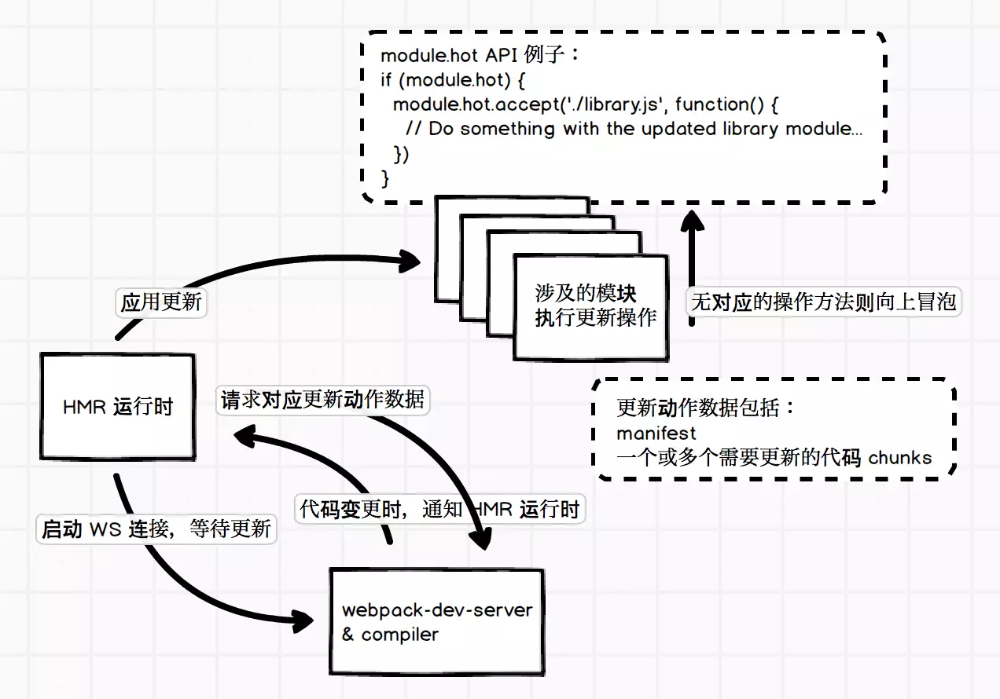

### 热替换

1. 复制 001 basic 为 004 optimize 
  
  ```sh 
  cp -r "001 basic" "004 optimize"
  ```

2. 设置 HMR

```js
 plugins: [
    new webpack.NamedModulesPlugin(),
    new webpack.HotModuleReplacementPlugin()
  ],
  devServer: {
    hot: true
  }
```  


3. 压缩图片

```js
{
  test: /\.(png|jpe?g|gif|svg|webp)$/,
  use: [
    {
      loader: 'url-loader',
      options: {
        limit: 8192
      }
    },
    {
      loader: 'image-webpack-loader',
      options: {
        mozjpeg: {  // 压缩 jpeg 的配置
          progressive: true,
          quality: 65
        },
        optipng: {  // 使用 imagemin-optipng 压缩 png，enable: false 为关闭
          enabled: false,
        },
        pngquant: { // 使用 imagemin-pngquant 压缩 png
          quality: '65-90',
          speed: 4
        },
        gifsicle: { // 压缩 gif 的配置
          interlaced: false
        },
        webp: { // 开启 webp，会把 jpg 和 png 图片压缩为 webp 格式
          quality: 75
        }
      }
    }
  ]
}
```


### HMR 运行原理

> webpack 内部运行时，会维护一份用于管理构建代码时各个模块之间交互的表数据，webpack 官方称之为 Manifest，其中包括入口代码文件和构建出来的 bundle 文件的对应关系。可以使用 WebpackManifestPlugin 插件来输出这样的一份数据。




> 开启了 hot 功能的 webpack 会往我们应用的主要代码中添加 WS 相关的代码，用于和服务器保持连接，等待更新动作。

> 当你配置了 HMR 的插件时，会往应用代码中添加 HMR 运行时的代码，主要用于定义代码模块应用更新时的 API，后面会详细介绍。

> 源码：HotModuleReplacement.runtime.js](https://link.juejin.im/?target=https%3A%2F%2Fgithub.com%2Fwebpack%2Fwebpack%2Fblob%2Fmaster%2Flib%2FHotModuleReplacement.runtime.js)

> 有了这两个部分就可以支持整个 HMR 的功能了。我们先忽略流程图的右上角部分，左下角的流程相对容易理解：当有更新时，webpack-dev-server 发送更新信号给 HMR 运行时，然后 HMR 再请求所需要的更新数据，请求的更新数据没有问题的话就应用更新。

> 如果 HMR 只是简单替换了代码模块的内容，如替换掉所谓的 installedModules 中需要更新的部分，那么这样并没有办法把更新后的结果实时地在浏览器上显示出来，所以才会需要流程图的右上角部分。

> 前面提到的 HMR 运行时代码会提供定义代码模块应用更新时执行的 API，这些 API 可以让我们在模块中定义接收到 HMR 更新应用信号时，需要额外做什么工作。例如， style-loader 就需要实现 HMR 接口，当收到更新时，使用新的样式替换掉旧的样式，大概是这样：

```js
if (module.hot) {
  module.hot.accept('/some/path', function() {
    // ... 用新样式替换旧样式
  })
}
```

> 详情可以参考 style-loader 中的代码实现：[HMR interface implemention in style-loader](https://link.juejin.im/?target=https%3A%2F%2Fgithub.com%2Fwebpack-contrib%2Fstyle-loader%2Fblob%2Fmaster%2Findex.js%23L36)。

> HMR 应用更新时是使用 webpackHotUpdate 来处理的：

```js
webpackHotUpdate(id, { 
  'modulePath': 
  function() {
    // 模块更新后的代码
  }
})
```

> 执行 webpackHotUpdate 时如发现模块代码实现了 HMR 接口，就会执行相应的回调或者方法，从而达到应用更新时，模块可以自行管理自己所需要额外做的工作。不过，并不是所有的模块都需要做相关的处理，当遇见没有实现 HMR 接口的模块时，就会往上层冒泡，如本节开头部分的流程图所示。


> 这里还有一个问题是，webpack 如何保证 HMR 接口中的引用是最新的模块代码？我们看一个简单的例子：

```js
import './index.css'
import hello from './bar'

hello()

if (module.hot) {
  module.hot.accept('./bar', () => {
    // console.log('Accepting the updated bar module!')
    hello()
  })
}
```

> 从代码上看，hello 都是同一个，这样的话并没有办法引用最新的模块代码，但是我们看一下上述代码在 webpack 构建后的结果：

```js
if (true) {
  module.hot.accept("./src/bar.js", function(__WEBPACK_OUTDATED_DEPENDENCIES__) { 
    /* harmony import */ 
    __WEBPACK_IMPORTED_MODULE_1__bar__ = __webpack_require__("./src/bar.js"); 
    (() => {
      // console.log('Accepting the updated bar module!')
      Object(__WEBPACK_IMPORTED_MODULE_1__bar__["default"])()
    })(__WEBPACK_OUTDATED_DEPENDENCIES__); 
  })
}
```


> 其他代码比较杂，我们集中看 module.hot 的处理部分。这里可以发现，我们的 hello 已经重新使用 __webpack_require__ 来引用了，所以可以确保它是最新的模块代码。

> 基本上 HMR 的执行原理就是这样，更具体的实现部分就不展开讲解了。在日常开发中，我们需要更多的工具来帮助我们实现 HMR 的接口，避免编写过多 HMR 需要的代码。例如，React 在组件代码更新时可能需要触发重新 render 来实现实时的组件展示效果，官方提供了一些现有的工具，需要的可以参考一下：[hot module replacement tools](https://link.juejin.im/?target=https%3A%2F%2Fwebpack.js.org%2Fguides%2Fhot-module-replacement%2F%23other-code-and-frameworks)。


### module.hot 常见的 API

> 前面 HMR 实现部分已经讲解了实现 HMR 接口的重要性，下面来看看常见的 module.hot API 有哪些，以及如何使用。

> 之前已经简单介绍过，module.hot.accept 方法指定在应用特定代码模块更新时执行相应的 callback，第一个参数可以是字符串或者数组，如：

```js
if (module.hot) {
  module.hot.accept(['./bar.js', './index.css'], () => {
    // ... 这样当 bar.js 或者 index.css 更新时都会执行该函数
  })
}
```

> module.hot.decline 对于指定的代码模块，拒绝进行模块代码的更新，进入更新失败状态，如 module.hot.decline('./bar.js')。这个方法比较少用到。

> module.hot.dispose 用于添加一个处理函数，在当前模块代码被替换时运行该函数，例如：

```js
if (module.hot) {
  module.hot.dispose((data) => {
    // data 用于传递数据，如果有需要传递的数据可以挂在 data 对象上，然后在模块代码更新后可以通过 module.hot.data 来获取
  })
}
```

> module.hot.accept 通常用于指定当前依赖的某个模块更新时需要做的处理，如果是当前模块更新时需要处理的动作，使用 module.hot.dispose 会更加容易方便。

> module.hot.removeDisposeHandler 用于移除 dispose 方法添加的 callback。

关于 module.hot 的更多 API 详情可以参考官方文档：[Hot Module Replacement APIs](https://link.juejin.im/?target=https%3A%2F%2Fdoc.webpack-china.org%2Fapi%2Fhot-module-replacement)。


### CSS Sprites

> webpack 3.x 版本，需要 CSS Sprites 的话，可以使用 webpack-spritesmith 或者 sprite-webpack-plugin

> 以 webpack-spritesmith 为例

```js
module: {
  loaders: [
    // ... 这里需要有处理图片的 loader，如 file-loader
  ]
},
resolve: {
  modules: [
    'node_modules', 
    'spritesmith-generated', // webpack-spritesmith 生成所需文件的目录
  ],
},
plugins: [
  new SpritesmithPlugin({
    src: {
      cwd: path.resolve(__dirname, 'src/ico'), // 多个图片所在的目录
      glob: '*.png' // 匹配图片的路径
    },
    target: {
      // 生成最终图片的路径
      image: path.resolve(__dirname, 'src/spritesmith-generated/sprite.png'), 
      // 生成所需 SASS/LESS/Stylus mixins 代码，我们使用 Stylus 预处理器做例子
      css: path.resolve(__dirname, 'src/spritesmith-generated/sprite.styl'), 
    },
    apiOptions: {
      cssImageRef: "~sprite.png"
    },
  }),
],
```

> 在你需要的样式代码中引入 sprite.styl 后调用需要的 mixins 即可：


```Styl
import '~sprite.styl'

.close-button
    sprite($close)
.open-button
    sprite($open)
```


> webpack 4.x，你需要配合使用 postcss 和 postcss-sprites，才能实现 CSS Sprites 的相关构建。


### 图片压缩


**image-webpack-loader**

```js
module.exports = {
  // ...
  module: {
    rules: [
      {
        test: /.*\.(gif|png|jpe?g|svg|webp)$/i,
        use: [
          {
            loader: 'file-loader',
            options: {}
          },
          {
            loader: 'image-webpack-loader',
            options: {
              mozjpeg: { // 压缩 jpeg 的配置
                progressive: true,
                quality: 65
              },
              optipng: { // 使用 imagemin-optipng 压缩 png，enable: false 为关闭
                enabled: false,
              },
              pngquant: { // 使用 imagemin-pngquant 压缩 png
                quality: '65-90',
                speed: 4
              },
              gifsicle: { // 压缩 gif 的配置
                interlaced: false,
              },
              webp: { // 开启 webp，会把 jpg 和 png 图片压缩为 webp 格式
                quality: 75
              },
          },
        ],
      },
    ],
  },
}
```


### 使用 DataURL


> url-loader 和 file-loader 的功能类似，但是在处理文件的时候，可以通过配置指定一个大小，当文件小于这个配置值时，url-loader 会将其转换为一个 base64 编码的 DataURL，配置如下：


```js
module.exports = {
  // ...
  module: {
    rules: [
      {
        test: /\.(png|jpg|gif)$/,
        use: [
          {
            loader: 'url-loader',
            options: {
              limit: 8192, // 单位是 Byte，当文件小于 8KB 时作为 DataURL 处理
            },
          },
        ],
      },
    ],
  },
}
```


### 代码压缩


**html-webpack-plugin**


```js
module.exports = {
  // ...
  plugins: [
    new HtmlWebpackPlugin({
      filename: 'index.html', // 配置输出文件名和路径
      template: 'assets/index.html', // 配置文件模板
      minify: { // 压缩 HTML 的配置
        minifyCSS: true, // 压缩 HTML 中出现的 CSS 代码
        minifyJS: true // 压缩 HTML 中出现的 JS 代码
      }
    }),
  ],
}
```

**css-loader**


```js
module.exports = {
  module: {
    rules: [
      // ...
      {
        test: /\.css/,
        include: [
          path.resolve(__dirname, 'src'),
        ],
        use: [
          'style-loader',
          {
            loader: 'css-loader',
            options: {
              minimize: true, // 使用 css 的压缩功能
            },
          },
        ],
      },
    ],
  }
}
```


### 分离代码文件


> 3.x 以前的版本是使用 CommonsChunkPlugin 来做代码分离的，而 webpack 4.x 则是把相关的功能包到了 optimize.splitChunks 中，直接使用该配置就可以实现代码分离


> webpack 的作者推荐直接这样简单地配置：

```js
module.exports = {
  // ... webpack 配置

  optimization: {
    splitChunks: {
      chunks: "all", // 所有的 chunks 代码公共的部分分离出来成为一个单独的文件
    },
  },
}
```

> 我们需要在 HTML 中引用两个构建出来的 JS 文件，并且 commons.js 需要在入口代码之前。下面是个简单的例子：

```html
<script src="commons.js" charset="utf-8"></script>
<script src="entry.bundle.js" charset="utf-8"></script>
```


> 如果你使用了 html-webpack-plugin，那么对应需要的 JS 文件都会在 HTML 文件中正确引用，不用担心。如果没有使用，那么你需要从 stats 的 entrypoints 属性来获取入口应该引用哪些 JS 文件，可以参考 [Node API](https://webpack.docschina.org/api/node/) 了解如何从 stats 中获取信息，或者开发一个 plugin 来处理正确引用 JS 文件这个问题。


> 显式配置共享类库可以这么操作：

> 第一种做法是显示指定哪些类库作为公共部分
> 第二种做法实现的功能差不多，只是利用了 test 来做模块路径的匹配
> 第三种做法是把所有在 node_modules 下的模块，即作为依赖安装的，都作为公共部分。

```js
module.exports = {
  entry: {
    vendor: ["react", "lodash", "angular", ...], // 指定公共使用的第三方类库
  },
  optimization: {
    splitChunks: {
      cacheGroups: {
        vendor: {
          chunks: "initial",
          test: "vendor",
          name: "vendor", // 使用 vendor 入口作为公共部分
          enforce: true,
        },
      },
    },
  },
  // ... 其他配置
}

// 或者
module.exports = {
  optimization: {
    splitChunks: {
      cacheGroups: {
        vendor: {
          test: /react|angluar|lodash/, // 直接使用 test 来做路径匹配
          chunks: "initial",
          name: "vendor",
          enforce: true,
        },
      },
    },
  },
}

// 或者
module.exports = {
  optimization: {
    splitChunks: {
      cacheGroups: {
        vendor: {
          chunks: "initial",
          test: path.resolve(__dirname, "node_modules") // 路径在 node_modules 目录下的都作为公共部分
          name: "vendor", // 使用 vendor 入口作为公共部分
          enforce: true,
        },
      },
    },
  },
}
```


### 按需加载模块


> 在 webpack 的构建环境中，要按需加载代码模块很简单，遵循 ES 标准的动态加载语法 dynamic-import 来编写代码即可，webpack 会自动处理使用该语法编写的模块：


```js
// import 作为一个方法使用，传入模块名即可，返回一个 promise 来获取模块暴露的对象
// 注释 webpackChunkName: "lodash" 可以用于指定 chunk 的名称，在输出文件时有用
import(/* webpackChunkName: "lodash" */ 'lodash').then((_) => { 
  console.log(_.lash([1, 2, 3])) // 打印 3
})
```

> 注意一下，如果你使用了 Babel 的话，还需要 [Syntax Dynamic Import](https://link.juejin.im/?target=https%3A%2F%2Fbabeljs.io%2Fdocs%2Fplugins%2Fsyntax-dynamic-import%2F) 这个 Babel 插件来处理 import() 这种语法。


由于动态加载代码模块的语法依赖于 promise，对于低版本的浏览器，需要添加 promise 的 [polyfill](https://link.juejin.im/?target=https%3A%2F%2Fgithub.com%2Fstefanpenner%2Fes6-promise) 后才能使用。


> 如上的代码，webpack 构建时会自动把 lodash 模块分离出来，并且在代码内部实现动态加载 lodash 的功能。动态加载代码时依赖于网络，其模块内容会异步返回，所以 import 方法是返回一个 promise 来获取动态加载的模块内容。


> import 后面的注释 webpackChunkName: "lodash" 用于告知 webpack 所要动态加载模块的名称。我们在 webpack 配置中添加一个 output.chunkFilename 的配置：


```js
output: {
  path: path.resolve(__dirname, 'dist'),
  filename: '[name].[hash:8].js',
  chunkFilename: '[name].[hash:8].js' // 指定分离出来的代码文件的名称
},
```

> 如果没有添加注释 webpackChunkName: "lodash" 以及 output.chunkFilename 配置，那么分离出来的文件名称会以简单数字的方式标识，不便于识别。


